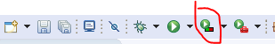

# Introduction

This assignment revolves around the use of gitflow and testing. The main objective of this assignment is to create a software component that stores information about surveys and responses.

This component does not have a user interface or connection to external storage. It only contains a "controller" class with methods that support various features the only way to know if the code successfully works is through a test suite created using JUnit. I followed a Test-Driven development approach when creating this project and each commit contains tests and the appropriate code.

This assignment requires me to also have the following sections :

* A scrum sprint backlog and a estimation of the tasks i wanted to complete

* A section detailing TDD(Test Driven Development) and how I created this project following this methodology.

* A section detailing a code coverage tool that I selected, why I selected it and how I used the tool

* A pull review checklist detailing a number of checks that a reviewer other than myself would make in the process of making pull requests

# Test coverage metric

Test coverage is defined as a metric in Software Testing that measures the amount of testing performed by a set of test. It will include gathering information about which parts of a program are executed when running the test suite to determine which branches of conditional statements have been taken.

### EclEmma

EclEmma is the tool i chose for test coverage in my project , EclEmma is a free Java code coverage tool for Eclipse, available under the Eclipse Public License. It brings code coverage analysis directly into the Eclipse workbench it provides the following benefits

1. Fast develop/test cycle: Launches from within the workbench like JUnit test runs can directly be analyzed for code coverage.
2. Rich coverage analysis: Coverage results are immediately summarized and highlighted in the Java source code editors.
3. Non-invasive: EclEmma does not require modifying your projects or performing any other setup.

### How To Use
This metric tool is actually built into the latest versions of eclipse meaning there is no need for any external downloads.

This tool is used by clicking the 3rd run button in the eclipse menu

