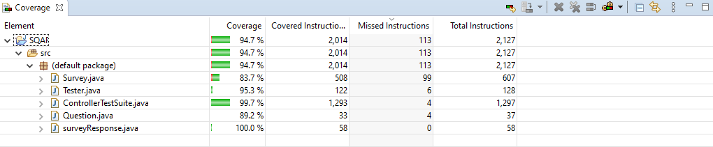
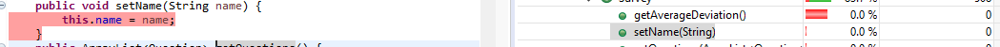
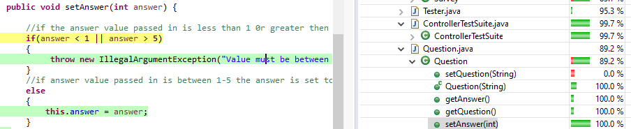
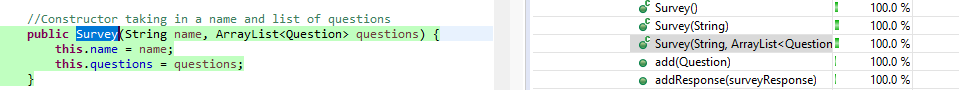
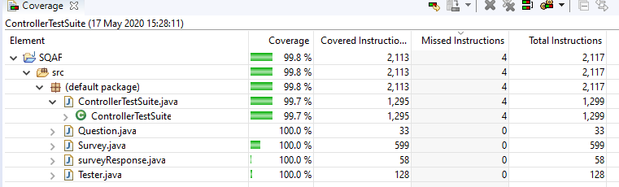

# Introduction

This assignment revolves around the use of gitflow and testing. The main objective of this assignment is to create a software component that stores information about surveys and responses.

This component does not have a user interface or connection to external storage. It only contains a "controller" class with methods that support various features the only way to know if the code successfully works is through a test suite created using JUnit. I followed a Test-Driven development approach when creating this project and each commit contains tests and the appropriate code.

This assignment requires me to also have the following sections :

* A scrum sprint backlog and a estimation of the tasks i wanted to complete

* A section detailing TDD(Test Driven Development) and how I created this project following this methodology.

* A section detailing a code coverage tool that I selected, why I selected it and how I used the tool

* A pull review checklist detailing a number of checks that a reviewer other than myself would make in the process of making pull requests

# Sprint Backlog 

This sprint backlog contains a list of tasks and the corresponding estimation associated with each task.

### Task estimation

To create estimations for my tasks I decided to go with what is known as "T-Shirt Sizing" this is a from of estimation used to size items in a sprint backlog. Items can be classified using t-shirt sizes (e.g. XS,S,M,L,XL). In this technique members of a team  would give each an item to size and at the end compare all estimates given. If all estimates are the same, that is considered as the ideal size, if not, then discuss among the team to arrive at the same estimate.

Because this assignment was not a team effort I had to create my own criteria for determining the size of an item. To do this I decided to base my t-shirt sizes off the complexity of the code that was associated with a task, the criteria followed as such:

Does the task.....

1. have method/methods that return a value?
2. include some sort of arithmetic operation?
3. include iterating through a collection?
4. include if/switch statements?
5. include creating new objects?
6. require a test?
7. include a loop?
8. include extracting information from an element in a collection?
9. include a method that takes in parameters

* If a task answers yes to less then 3 of the following questions it was deemed an S task.
* If a task answers yes to more then 3 but less then 7 of the following questions it was deemed an M task.
* If a task answers yes to 7 or more of the following questions it was deemed an L task.

### Tasks

**Initial tasks and estimates**

A list of the initial tasks and estimations.

* Create new survey - S
* Add a question to a survey - S
* Get a list of all surveys - M
* Get a survey by name - M
* Creating a survey response - S
* Adding an answer to a survey response - S
* Getting all survey responses associated with a specific survey - L
* Get average deviation of a survey  - L
* Get standard deviation of a survey - L
* Get maximum score of a survey - L
* Get minimum score of a survey - L
* Get standard deviation for a specific question on a survey - L
* Get maximum score for a specific question on a survey - L
* Get minimum score for a specific question on a survey - L

**Additional Tasks**
* Get the sum value of question answers in a survey response - L
* Ensure a question answer value is between 1-5 - M
* Get a list of all surveys - M

**Task Comparison**

Two tasks that I will compare are:

1. Get average deviation of a survey
2. Add a question to a survey

| Question 	| Task 1 	| Task 2 	|
|----------	|--------	|--------	|
| 1        	| Yes    	| No     	|
| 2        	| Yes    	| No     	|
| 3        	| Yes    	| No     	|
| 4        	| NO     	| No     	|
| 5        	| NO     	| Yes    	|
| 6        	| Yes    	| Yes    	|
| 7        	| Yes    	| No     	|
| 8        	| Yes    	| No     	|
| 9        	| Yes    	| No     	|
| SUM      	| 7      	| 2      	|

As we can see task one answers yes to 7 questions meaning the it is L while task 2 only answers yes to 2 meaning that it is S 

**Velocity Metric Calculation**

I decided to give each t-shirt size a corresponding numerical value S = 1 , M = 2 , L = 3

To calculation of the velocity metric follows as:

* get the number of tasks completed by t-shirt size e.g. [s:2 ,m:3, l:1]
* multiply the number value of the tasks completed by the numerical value assigned to each t-shirt size e.g. [s:2x1, m:3x2, l:3x1] = [s:2, m:6, l:3]
* get the sum of the numerical values calculated e.g. 2+6+1 = 9
* divided the sum by 3 because there are 3 t-shirt sizes to get the velocity metric e.g. 9/3 = 3

I would use this velocity metric to determine how fast the team is working in relation to the task sizes , the greater the number the more tasks getting completed.

# Test-Driven Development

Test-driven development (TDD) is a software development process that relies on the repetition of a very short development cycle: first the developer writes an (initially failing) automated test case that defines a desired improvement or new function, then produces the minimum amount of code to pass that test, and finally refactors the new code to acceptable standards.

In this [commit](https://github.com/Lordjiggyx/SQAF/commit/8f7443e27b3ca45ebcd074a796332a1483fd9403) I created 5 tests for the initial survey response object each one of these test were failing test, the methods or objects were not present or not correctly implemented.

The next 5 commits show the changing of code which allowed the tests to pass

* [Test 1](https://github.com/Lordjiggyx/SQAF/commit/d11f38f5fa6fde0cba27d090886f63fc6c673d03) - This commit shows the creation of the Survey Response class and how i implement it in the Question class, I also had to change the test to check for an instance of survey class being created.

* [Test 2](https://github.com/Lordjiggyx/SQAF/commit/b3829374824ccbd9b662235e2ccc9021966159e1) - This commit shows mw changing the way i used the Junit Assertion i wanted to check that the value set to the answer was the hardcoded value i had given it rather then an empty value or null.

* [Test 3](https://github.com/Lordjiggyx/SQAF/commit/8d7e25f4ce8b32d464770536ee830be88f1b5c3e) - This commit shows me changing the setAnswer method to determine if a value is set between 1-5 if it is the answer is set to 0 (This is later chnaged to an IllegalArgumentException)

* [Test 4](https://github.com/Lordjiggyx/SQAF/commit/987c944233fdc15e9e1a17c2a17a84ba22fe3e38) - This commit shows me uncommenting the test created in the first commit.

* [Test 5](https://github.com/Lordjiggyx/SQAF/commit/836b38a555c7d3205c5c51fae3f7b4d230289d0c) - This commit shows me creating a method in the Survey class that gets an array for the question answers in a survey Response and the correspsonding test

# Test coverage metric

### EclEmma

EclEmma is the tool i chose for test coverage in my project , EclEmma is a free Java code coverage tool for Eclipse, available under the Eclipse Public License. It brings code coverage analysis directly into the Eclipse workbench it provides the following benefits

1. Fast develop/test cycle: Launches from within the workbench like JUnit test runs can directly be analyzed for code coverage.
2. Rich coverage analysis: Coverage results are immediately summarized and highlighted in the Java source code editors.
3. Non-invasive: EclEmma does not require modifying your projects or performing any other setup.

### How To Use
This metric tool is actually built into the latest versions of eclipse meaning there is no need for any external downloads.

This tool is used by clicking the 3rd run button in the eclipse menu

Once this button has been clicked your workspace should should display the project and the corresponding test coverage value when you click into each folder it displays the coverage percentage of each corresponding folder or file in the project , when you click into java flies it shows the corresponding methods and their coverage value

In the case of my project I have a high initial coverage of 94.7%, however this means that some pieces of code are not being executed or covered by tests. ECLEmma identifies pieces of code with 3 different colours: Red, Yellow and Green

#### Red

As we can see the method setName is not executed at all thus EclEmma highlights it red and assigns it a coverage value of 0%, removing methods or block of code highlighted red will increase the overall coverage metric as it means less pieces of code not being used are present.

#### Yellow

As we can see the method setAnswer has a coverage value of 100% however a piece of code is highlighted yellow, this means this piece of code is partially covered this means that there is another condition that could have been covered

#### Green

Any line piece of code that has been highlighted green has been executed by tests and therefore has been covered.

### EclEmma Corrections

As we can see in the original screenshot my project had a coverage score of 94.7% this meant that i needed to make a number of changes in order to increase this coverage metric

After making changes in the following [commit](https://github.com/Lordjiggyx/SQAF/commit/ac5ac12ee3c9e62815f1dd24394938d7c085e7bb) We can see that the coverage metric for my project increased to 99.8%. I have never used this tool before and never understood what test coverage means after using it now i see the advantage of using this tool.

# Team Version Control

To manage version control for this project I used the gitflow process.

## What is the Gitflow

Gitflow is a workflow process that defines a branching model for a scheduled project release.This is used mainly for managing large projects. The master branch and the develop branches are used to record the project history and the remaining branches can fall into many categories of branches e.g feature branches , hotfix branches and release branches.

## My Branches

##### Master
This branch is where the final project containing all documentation and code would be located no changes to this branch are allowed, only pull requests from the develop branch are allowed

##### Develop
This branch is where any near final changes are located before making it into the master branch this branch only takes pull requests from either the Docbranch or Devbranch.

##### DevBranch
This branch is includes any final additional features to the actual code of the project, pull requests for this branch must be from a branch with the following format <BRANCH_NAME-DEV>.

##### DocBranch
This branch is includes any final additional features/sections to the documentation of the project, pull requests for this branch must be from a branch with that does not follow the Devbranch naming format.

the other branches in the project are created to add additional content to these 4 branches. each branch will be merged to one of the following four branches and then to the develop branch only upon project completion will the develop branch be merged to the master branch and a release branch will be created.

 #### List of branches created:

* **TDD** - Branch containing Test Driven Development content for documentation

* **SprintBacklog** - Branch containing Sprint Backlog and task estimation  content for documentation

* **MetricTool** - Branch containing Test coverage content for documentation

* **VersionControl** - Branch containing Team version control content for documentation

* **ReviewChecklist** - Branch containing Sprint Backlog content for documentation

* **Controller-DEV** - building on all the pieces of code from the other branches this branch housed the controller and the test suite for the controller.

* **Arithmetic1-DEV** - Branch conatained the initial arithmetic operations that were corrected I had made a logical error in how i was conducting these operations which are explained in the [pull request](https://github.com/Lordjiggyx/SQAF/pull/7) related to this branch.

* **Arithmetic-DEV** - Branch conatained the initial arithmetic operations that were meant to be conducted on the survey class.

* **Survey-DEV** - Branch contained the initial code for the application with the creation of the survey and question classes including tests

* **SurveyResponse-DEV** - Branch contained the code related to the survey response class including tests

# Review Checklist

### What is a code review?

A code review is the process by which programmers examine the code of their peers. In order to share knowledge with each other as well as 
checking for bugs and to estimate the code quality. It has been shown to accelerate and streamline the software development process.

A code review involves checking for things like :
 * Obvious logic errors in the code.
 * Have the requirements for each use case been implemented?
 * Are the current tests sufficient for the new code, will new tests need to be written?
 
My checklist included the following:

#### Pull request format

1. Name of pull request in the form " Pull Request Title:_____ "
2. Each pull request should address only one issue 
3. Each commit in the pull request has a meaningful commit message

#### Modifications

**Briefly describe the changes made**

#### Verification of change

**Can only be one of the following**

1. Trivial change - syntax , grammar , code cleanup no need for test
2. Change is already covered by existing tests
3. Change required addition of tests

#### Feature
1. Does this pull request introduce a new feature? (yes / no)
2. If yes how is this feature tested / if no was this a bug fix (yes/no)

Process followed in the following [pull request](https://github.com/Lordjiggyx/SQAF/pull/2)
